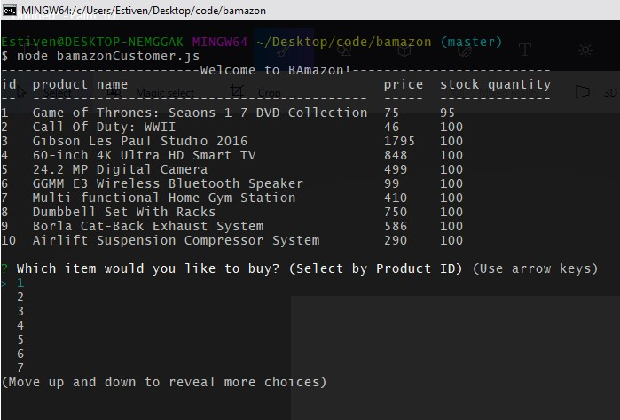
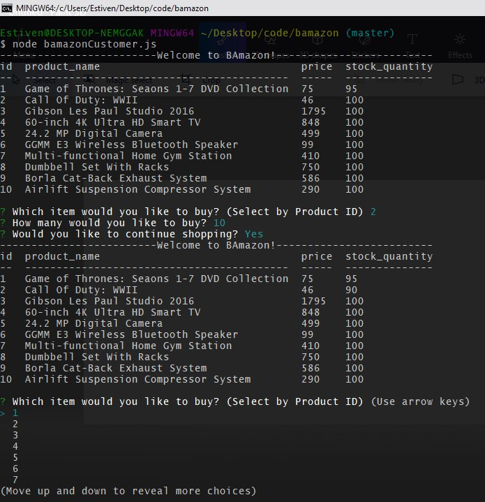
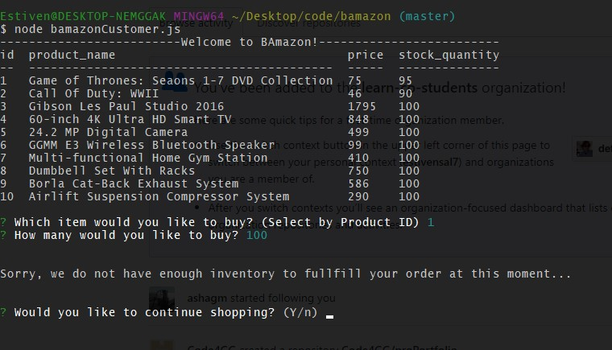

# Bamazon!

##Shop using Bamazon! (MySQL Application)
Bamazon is an Amazon-like store front where clients may view the store's inventory in the command line, and select which items they would like to purchase. Once the user has selected an item through the ID number displayed, clients will then be asked to input a quantity. If the store's inventory is greater than the quantity request, the order will be fullfilled. Otherwise, the user will be informed that the store at the moment does not have the requested quantity in stock.

## Installation
	1. Clone the git repository to your command line/terminal
	
	1. run an "npm install" for mysql, inquirer, and console.table packages in the command line/terminal.
	
	1. Lastly run a "node bamazonCustomer.js" command to begin shopping!

Below you will find screenshots of the application in action...

### Author
	Estiven Salazar
></content>